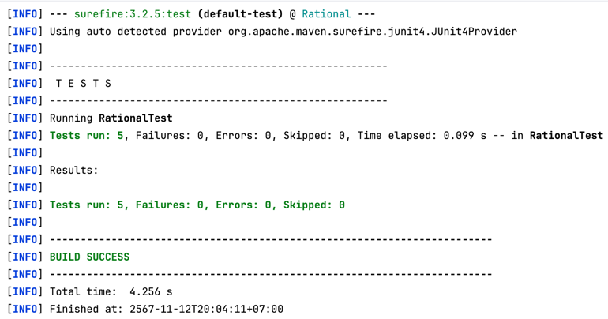

# ITCS371-Rational
An example Java project for the JUnit exercise of ITCS371 Introduction to Software Engineering class.
ไฟล์นี้ประกอบด้วยรายละเอียดเกี่ยวกับ test suites ที่ถูกสร้างขึ้นในคลาส `RationalTest` เพื่อทดสอบพฤติกรรมต่างๆ ของคลาส `Rational`

## รายละเอียดของแต่ละ Test Suite
# 1. `testSubtract` Suite

## จุดประสงค์
เป้าหมายของ `testSubtract` คือการตรวจสอบว่าการลบจำนวนเศษส่วนสองจำนวนทำงานได้ถูกต้อง

## ฟังก์ชันที่ทดสอบได้
- **เมธอด**: `subtract(Rational r)`
    - **พารามิเตอร์**: `r` (Rational)
    - **ประเภทผลลัพธ์**: `void`
    - **ค่าผลลัพธ์**: ดำเนินการลบกับออบเจ็กต์ `this`
    - **พฤติกรรมข้อยกเว้น**: ขว้างข้อยกเว้นหาก `r` เป็น `null`

## คุณลักษณะแบบ Interface-Based

### 1. การสร้างโมเดล Input Domain
#### คุณลักษณะ
- **C1**: ตัวดำเนินการลบ
- **C2**: เศษส่วนที่ได้หลังการลบ

#### การแบ่งพาร์ทิชันของคุณลักษณะ
| คุณลักษณะ              | b1                     | b2                   |
|------------------------|------------------------|----------------------|
| C1 = ตัวดำเนินการลบ     | ออบเจ็กต์ `Rational` ที่ถูกต้อง | `null` (ขว้างข้อยกเว้น) |
| C2 = เศษส่วนที่ได้หลังการลบ | ย่อเศษส่วน            | คงค่าเดิมของตัวส่วน |

### 2. การรวมพาร์ทิชันเพื่อกำหนดข้อกำหนดการทดสอบ
- **ข้อกำหนดการทดสอบ**: กำหนด 2 กรณีทดสอบจากการรวมกัน

### 3. ค่าทดสอบและค่าผลลัพธ์ที่คาดหวัง
| กรณีทดสอบ | ตัวดำเนินการลบ | เศษส่วนที่ได้        | ผลลัพธ์ที่คาดหวัง |
|------------|----------------|----------------------|-------------------|
| T1         | `3/4 - 1/4`    | ย่อเศษส่วน            | ผลลัพธ์เป็น `1/2` |
| T2         | `3/4 - 2/4`    | คงค่าเดิมของตัวส่วน   | ผลลัพธ์เป็น `1/4` |

---

## คุณลักษณะแบบ Functionality-Based

### 1. การสร้างโมเดล Input Domain
#### คุณลักษณะ
- **C1**: ความถูกต้องของตัวดำเนินการ
- **C2**: ผลลัพธ์จากการดำเนินการ

#### การแบ่งพาร์ทิชันของคุณลักษณะ
| คุณลักษณะ                 | b1                    | b2                         |
|---------------------------|-----------------------|----------------------------|
| C1 = ความถูกต้องของตัวดำเนินการ | ถูกต้อง                 | ไม่ถูกต้อง (เช่น `null`)       |
| C2 = ผลลัพธ์               | ย่อเศษส่วน            | คงค่าเดิมของเศษส่วน           |

### 2. การรวมพาร์ทิชันเพื่อกำหนดข้อกำหนดการทดสอบ
- **ข้อกำหนดการทดสอบ**: 2 กรณีทดสอบ

### 3. ค่าทดสอบและค่าผลลัพธ์ที่คาดหวัง
| กรณีทดสอบ | ตัวดำเนินการ         | ผลลัพธ์        | ผลลัพธ์ที่คาดหวัง                  |
|------------|----------------------|-----------------|------------------------------------|
| T1         | ตัวดำเนินการถูกต้อง  | ย่อเศษส่วน      | ผลลัพธ์เป็น `1/2`                 |
| T2         | ตัวดำเนินการเป็น `null` | คงค่าเดิมของเศษส่วน | ขว้างข้อยกเว้นหรือเกิดข้อผิดพลาด  |

## จำนวนการทดสอบทั้งหมด
กำหนดการทดสอบทั้งหมด **4 กรณีทดสอบ**:
- 2 กรณีทดสอบจากคุณลักษณะแบบ Interface-Based
- 2 กรณีทดสอบจากคุณลักษณะแบบ Functionality-Based

## ISP 
- **วิธีการ**: ACoC (All Combination) รวมทุกค่าของพาร์ทิชันที่เป็นไปได้ในแต่ละคุณลักษณะเพื่อสร้างการทดสอบแบบครอบคลุมทุกการรวมกัน
- **คุณลักษณะ**:
    - C1 = Operand (ตัวดำเนินการลบ)
        - b1: ออบเจ็กต์ `Rational` ที่ถูกต้อง
        - b2: `null` (ขว้างข้อยกเว้น)
    - C2 = Resulting fraction (เศษส่วนที่ได้หลังการลบ)
        - b1: Reduced fraction (ย่อเศษส่วน)
        - b2: Fraction with the same denominator (คงค่าเดิมของตัวส่วน)
- **การรวมพาร์ทิชันด้วย ACoC**: 2 x 2 = 4 กรณีทดสอบ
- **Test Requirements**:
    - T1: `3/4 - 1/4` → คาดหวังผลลัพธ์ `1/2`
    - T2: `3/4 - 0` → คาดหวังผลลัพธ์ `3/4`
    - T3: `3/4 - null` → คาดหวังข้อยกเว้น
    - T4: `0 - 1/4` → คาดหวังผลลัพธ์ `-1/4`
---

# 2. `testMultiply` Suite

## จุดประสงค์
เป้าหมายของ `testMultiply` คือการตรวจสอบว่าการคูณจำนวนเศษส่วนสองจำนวนทำงานได้ถูกต้องและให้ผลลัพธ์ที่ถูกต้องหลังการย่อเศษส่วน

## ฟังก์ชันที่ทดสอบได้
- **เมธอด**: `multiply(Rational r)`
    - **พารามิเตอร์**: `r` (Rational)
    - **ประเภทผลลัพธ์**: `void`
    - **ค่าผลลัพธ์**: ดำเนินการคูณระหว่างออบเจ็กต์ `this` กับ `r`
    - **พฤติกรรมข้อยกเว้น**: ขว้างข้อยกเว้นหาก `r` เป็น `null`

## คุณลักษณะแบบ Interface-Based

### 1. การสร้างโมเดล Input Domain
#### คุณลักษณะ
- **C1**: ตัวดำเนินการคูณ
- **C2**: เศษส่วนที่ได้หลังการคูณ

#### การแบ่งพาร์ทิชันของคุณลักษณะ
| คุณลักษณะ              | b1                     | b2                        |
|------------------------|------------------------|---------------------------|
| C1 = ตัวดำเนินการคูณ     | ออบเจ็กต์ `Rational` ที่ถูกต้อง | `null` (ขว้างข้อยกเว้น)     |
| C2 = เศษส่วนที่ได้หลังการคูณ | ย่อเศษส่วน            | คงค่าเดิมของเศษส่วน (ถ้าคูณด้วย 1) |

### 2. การรวมพาร์ทิชันเพื่อกำหนดข้อกำหนดการทดสอบ
- **ข้อกำหนดการทดสอบ**: กำหนด 2 กรณีทดสอบจากการรวมกัน

### 3. ค่าทดสอบและค่าผลลัพธ์ที่คาดหวัง
| กรณีทดสอบ | ตัวดำเนินการคูณ     | เศษส่วนที่ได้        | ผลลัพธ์ที่คาดหวัง                   |
|------------|----------------------|----------------------|-------------------------------------|
| T1         | `3/2 * 2/6`         | ย่อเศษส่วน            | ผลลัพธ์เป็น `1/2`                   |
| T2         | `3/2 * 1/1`         | คงค่าเดิมของเศษส่วน   | ผลลัพธ์เป็น `3/2`                   |

---

## คุณลักษณะแบบ Functionality-Based

### 1. การสร้างโมเดล Input Domain
#### คุณลักษณะ
- **C1**: ความถูกต้องของตัวดำเนินการคูณ
- **C2**: ผลลัพธ์จากการดำเนินการ

#### การแบ่งพาร์ทิชันของคุณลักษณะ
| คุณลักษณะ                 | b1                    | b2                         |
|---------------------------|-----------------------|----------------------------|
| C1 = ความถูกต้องของตัวดำเนินการ | ถูกต้อง                 | ไม่ถูกต้อง (เช่น `null`)       |
| C2 = ผลลัพธ์               | ย่อเศษส่วน            | คงค่าเดิมของเศษส่วน            |

### 2. การรวมพาร์ทิชันเพื่อกำหนดข้อกำหนดการทดสอบ
- **ข้อกำหนดการทดสอบ**: 2 กรณีทดสอบ

### 3. ค่าทดสอบและค่าผลลัพธ์ที่คาดหวัง
| กรณีทดสอบ | ตัวดำเนินการคูณ     | ผลลัพธ์          | ผลลัพธ์ที่คาดหวัง                  |
|------------|----------------------|------------------|------------------------------------|
| T1         | ตัวดำเนินการถูกต้อง  | ย่อเศษส่วน        | ผลลัพธ์เป็น `1/2`                 |
| T2         | ตัวดำเนินการเป็น `null` | คงค่าเดิมของเศษส่วน | ขว้างข้อยกเว้นหรือเกิดข้อผิดพลาด   |

## จำนวนการทดสอบทั้งหมด
กำหนดการทดสอบทั้งหมด **4 กรณีทดสอบ**:
- 2 กรณีทดสอบจากคุณลักษณะแบบ Interface-Based
- 2 กรณีทดสอบจากคุณลักษณะแบบ Functionality-Based

## ISP
- **วิธีการ**: ECC (Each Choice Coverage) เลือกค่าที่เป็นไปได้ในแต่ละพาร์ทิชันของทุกคุณลักษณะ เพื่อสร้างการทดสอบที่ครอบคลุมค่าแต่ละประเภทอย่างน้อยหนึ่งครั้ง
- **คุณลักษณะ**:
    - C1 = Operand (ตัวดำเนินการคูณ)
        - b1: ออบเจ็กต์ `Rational` ที่ถูกต้อง
        - b2: `null` (ขว้างข้อยกเว้น)
    - C2 = Resulting fraction (เศษส่วนที่ได้หลังการคูณ)
        - b1: Reduced fraction (ย่อเศษส่วน)
        - b2: Unchanged fraction (คงค่าเดิมของเศษส่วน ถ้าคูณด้วย 1)
- **การรวมพาร์ทิชันด้วย ECC**: Max(2,2) = 2 กรณีทดสอบ
- **Test Requirements**:
    - T1: `3/2 * 2/6` → คาดหวังผลลัพธ์ `1/2`
    - T2: `3/2 * 1/1` → คาดหวังผลลัพธ์ `3/2`

---

# 3. `testDivide` Suite

## จุดประสงค์
เป้าหมายของ `testDivide` คือการตรวจสอบว่าการหารจำนวนเศษส่วนสองจำนวนทำงานได้ถูกต้องและให้ผลลัพธ์ที่ถูกต้องหลังการย่อเศษส่วน

## ฟังก์ชันที่ทดสอบได้
- **เมธอด**: `divide(Rational r)`
    - **พารามิเตอร์**: `r` (Rational)
    - **ประเภทผลลัพธ์**: `void`
    - **ค่าผลลัพธ์**: ดำเนินการหารระหว่างออบเจ็กต์ `this` กับ `r`
    - **พฤติกรรมข้อยกเว้น**: ขว้างข้อยกเว้นหาก `r` เป็น `null`

## คุณลักษณะแบบ Interface-Based

### 1. การสร้างโมเดล Input Domain
#### คุณลักษณะ
- **C1**: ตัวดำเนินการหาร
- **C2**: เศษส่วนที่ได้หลังการหาร

#### การแบ่งพาร์ทิชันของคุณลักษณะ
| คุณลักษณะ              | b1                     | b2                         |
|------------------------|------------------------|----------------------------|
| C1 = ตัวดำเนินการหาร     | ออบเจ็กต์ `Rational` ที่ถูกต้อง | `null` (ขว้างข้อยกเว้น)      |
| C2 = เศษส่วนที่ได้หลังการหาร | ย่อเศษส่วน            | คงค่าเดิมของเศษส่วน (ถ้าหารด้วย 1) |

### 2. การรวมพาร์ทิชันเพื่อกำหนดข้อกำหนดการทดสอบ
- **ข้อกำหนดการทดสอบ**: กำหนด 2 กรณีทดสอบจากการรวมกัน

### 3. ค่าทดสอบและค่าผลลัพธ์ที่คาดหวัง
| กรณีทดสอบ | ตัวดำเนินการหาร | เศษส่วนที่ได้         | ผลลัพธ์ที่คาดหวัง |
|------------|-----------------|-----------------------|-------------------|
| T1         | `8/2 ÷ 2/4`     | ย่อเศษส่วน             | ผลลัพธ์เป็น `8/1` |
| T2         | `8/2 ÷ 1/2`     | คงค่าเดิมของเศษส่วน    | ผลลัพธ์เป็น `8/1` |

---

## คุณลักษณะแบบ Functionality-Based

### 1. การสร้างโมเดล Input Domain
#### คุณลักษณะ
- **C1**: ความถูกต้องของตัวดำเนินการหาร
- **C2**: ผลลัพธ์จากการดำเนินการ

#### การแบ่งพาร์ทิชันของคุณลักษณะ
| คุณลักษณะ                 | b1                    | b2                         |
|---------------------------|-----------------------|----------------------------|
| C1 = ความถูกต้องของตัวดำเนินการ | ถูกต้อง                 | ไม่ถูกต้อง (เช่น `null`)       |
| C2 = ผลลัพธ์               | ย่อเศษส่วน            | คงค่าเดิมของเศษส่วน            |

### 2. การรวมพาร์ทิชันเพื่อกำหนดข้อกำหนดการทดสอบ
- **ข้อกำหนดการทดสอบ**: 2 กรณีทดสอบ

### 3. ค่าทดสอบและค่าผลลัพธ์ที่คาดหวัง
| กรณีทดสอบ | ตัวดำเนินการหาร     | ผลลัพธ์          | ผลลัพธ์ที่คาดหวัง                   |
|------------|----------------------|------------------|-------------------------------------|
| T1         | ตัวดำเนินการถูกต้อง  | ย่อเศษส่วน        | ผลลัพธ์เป็น `8/1`                  |
| T2         | ตัวดำเนินการเป็น `null` | คงค่าเดิมของเศษส่วน | ขว้างข้อยกเว้นหรือเกิดข้อผิดพลาด    |

## จำนวนการทดสอบทั้งหมด
กำหนดการทดสอบทั้งหมด **4 กรณีทดสอบ**:
- 2 กรณีทดสอบจากคุณลักษณะแบบ Interface-Based
- 2 กรณีทดสอบจากคุณลักษณะแบบ Functionality-Based

## ISP

- **วิธีการ**: PWC (Pair-wise coverage) จับคู่ทุกคู่ของค่าจากคุณลักษณะสองตัวที่มีจำนวนพาร์ทิชันสูงสุดเพื่อให้ครอบคลุมทุกคู่ที่เป็นไปได้
- **คุณลักษณะ**:
    - C1 = Operand (ตัวดำเนินการหาร)
        - b1: ออบเจ็กต์ `Rational` ที่ถูกต้อง
        - b2: `null` (ขว้างข้อยกเว้น)
    - C2 = Resulting fraction (เศษส่วนที่ได้หลังการหาร)
        - b1: Properly reduced fraction (ย่อเศษส่วน)
        - b2: Fraction remains the same (คงค่าเดิมของเศษส่วน ถ้าหารด้วย 1)
- **การรวมพาร์ทิชันด้วย PWC**: 2 x 2 = 4 กรณีทดสอบ

### ค่าทดสอบและค่าผลลัพธ์ที่คาดหวัง
| Test Case | Operand            | Resulting Fraction      | Expected Outcome                |
|-----------|---------------------|-------------------------|---------------------------------|
| T1        | Valid Rational (e.g., `8/2`) | Properly reduced fraction    | `8/2 ÷ 2/4` → Result is `8/1`    |
| T2        | Valid Rational (e.g., `8/2`) | Fraction remains the same   | `8/2 ÷ 1/1` → Result is `4/1`    |
| T3        | `null`              | Properly reduced fraction    | Throws exception                |
| T4        | `null`              | Fraction remains the same   | Throws exception                |

---
# Result after run all test suites

# Result from using automated framework (Maven)

---